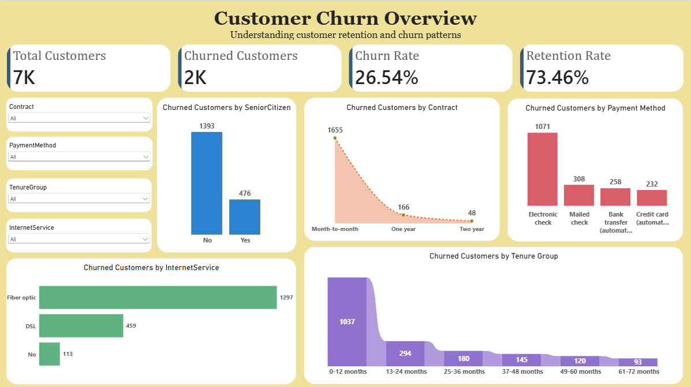
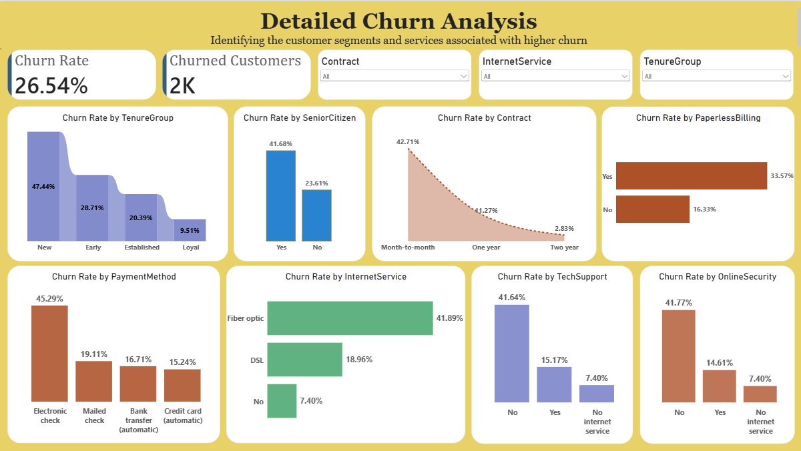
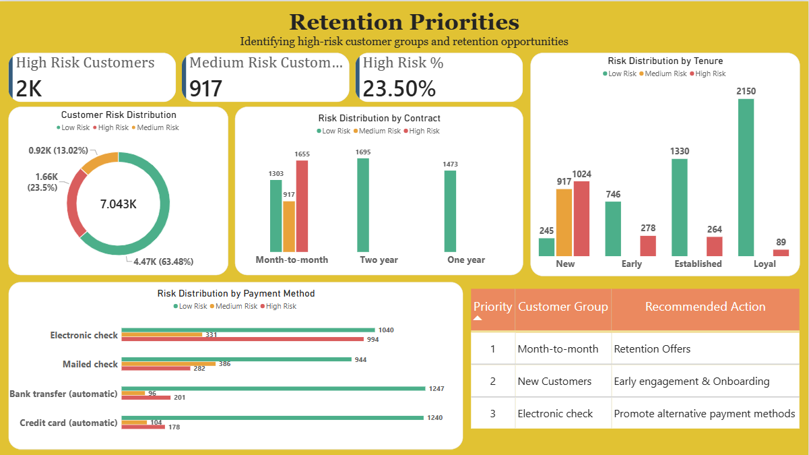

# 📉 Telco Customer Churn Analysis Dashboard

An interactive Power BI dashboard that analyzes customer churn, retention, revenue risk, and business KPIs for a telecom company — built on 7,000+ customer records using SQL, Python, and Power BI.

## 📖 Overview
The Telco Customer Churn Analysis Dashboard transforms raw customer data into actionable retention insights. It tracks churn rate, customer risk levels, revenue at risk, and service/contract patterns across three interactive report pages, helping stakeholders prioritize retention efforts without digging through raw data.

**Business problem:** Telecom companies lose significant revenue when customers churn, but not every customer carries the same risk. Without structured analysis, it's difficult to know which segments to target first or which levers (contract type, payment method, support services) actually reduce churn. This project centralizes that analysis into one interactive tool with clear, prioritized recommendations.

## 🛠️ Tech Stack
- **SQL** — data cleaning, transformation, aggregation, and analytical queries
- **Python** — exploratory data analysis
- **Excel** — initial data review and validation
- **Power BI Desktop** — interactive dashboard and data visualization
- **CSV dataset** — 7,043 customer records

## 📂 Dataset
7,043 telecom customer records with fields including Customer ID, Gender, Senior Citizen status, Tenure, Contract type, Payment Method, Internet Service, Tech Support, Online Security, Monthly Charges, Total Charges, and Churn status (Yes/No).

## 📊 Key Insights
- Out of 7,043 customers, **26.54%** churned, leaving a retention rate of **73.46%**.
- **Contract type is the strongest churn driver:** month-to-month customers churn at **42.71%** vs. just **2.83%** for two-year contracts.
- **Fiber optic customers churn at 41.89%** — the highest of any internet service type, more than double DSL (18.96%).
- **Electronic check payers churn at 45.29%**, far above automatic bank transfer (16.71%) or credit card (15.24%).
- **Tenure strongly predicts loyalty:** new customers (0–12 months) churn at **47.44%**, dropping to just **9.51%** for customers with 61–72 months tenure.
- **Senior citizens churn at 41.68%** vs. 23.61% for non-seniors, suggesting this group needs targeted retention support.
- Customers without **Tech Support (41.64%)** or **Online Security (41.77%)** churn at more than 5x the rate of those with these add-ons.
- Risk segmentation shows **~2,000 High Risk customers (23.5%)** and **917 Medium Risk customers**, concentrated in month-to-month contracts and new accounts — these segments carry the highest monthly revenue at risk.

## 📈 Dashboard Pages

### 🏠 Customer Churn Overview

- Total Customers, Churned Customers, Churn Rate, Retention Rate
- Churned customers by Senior Citizen status, Contract, Payment Method
- Churned customers by Internet Service and Tenure Group

### 🔍 Detailed Churn Analysis

- Churn rate by Tenure Group, Senior Citizen status, Contract, and Paperless Billing
- Churn rate by Payment Method and Internet Service
- Churn rate by Tech Support and Online Security availability

### 🎯 Retention Priorities

- High/Medium/Low Risk customer counts and risk distribution
- Risk distribution by Contract, Tenure Group, and Payment Method
- Prioritized recommended-action table by customer group

## 🧮 SQL Highlights
A few key queries power the risk analysis and KPI calculations:
- **Overall Churn Rate** — `ROUND(SUM(Churn = 'Yes') * 100.0 / COUNT(*), 2)` across the full customer base.
- **Churn Rate by Segment** — conditional aggregation across Contract, Payment Method, Internet Service, Tenure Group, and demographics.
- **Revenue at Risk** — `SUM(CASE WHEN Churn = 'Yes' THEN MonthlyCharges ELSE 0 END)` grouped by Tenure Group, to quantify monthly revenue lost to churned customers per segment.

## ✅ Recommended Actions
| Priority | Customer Group | Recommended Action |
|---|---|---|
| 1 | Month-to-month contracts | Offer incentives to shift to longer-term contracts |
| 2 | New customers (0–12 months) | Strengthen onboarding and early engagement |
| 3 | Electronic check payers | Promote automatic/alternative payment methods |

## 📸 Preview
| Overview | Detailed Analysis | Retention Priorities |
|---|---|---|
|  |  |  |

## 📁 Project Structure
```
customer-churn-analysis/
│
├── README.md
│
├── data/
│   ├── Cleaned data.xlxs
│   └── telco_customer_churn_cleaned.csv
│
├── sql/
│   └── telco_customer_churn.sql
│
├── python/
│   └── telco_customer_churn_analysis.ipynb
│
├── powerbi/
│    └── telco_customer_churn.pbix
│
└── screenshots/
        ├── Customer_churn_overview.png
        ├── detailed_churn_analysis.png
        └── retention_priorities.png
```

## 🚀 How to Use
1. Download or clone this repository.
2. Open `sql/telco_customer_churn.sql` to review the SQL data preparation and analysis queries.
3. Open `python/churn_analysis.ipynb` to review the Python-based exploratory analysis.
4. Open the Power BI dashboard file in Power BI Desktop to explore the report interactively.
5. Refer to the screenshots in `screenshots/` for a quick preview of the analysis.

## 👤 Author
**Priya Choudhary**
Aspiring Data Analyst
📧 priyach638827@gmail.com
🔗 [LinkedIn](https://linkedin.com/in/priya-choudhary) • [GitHub](https://github.com/priya27)

## 📄 License
This project is for portfolio and educational purposes.
